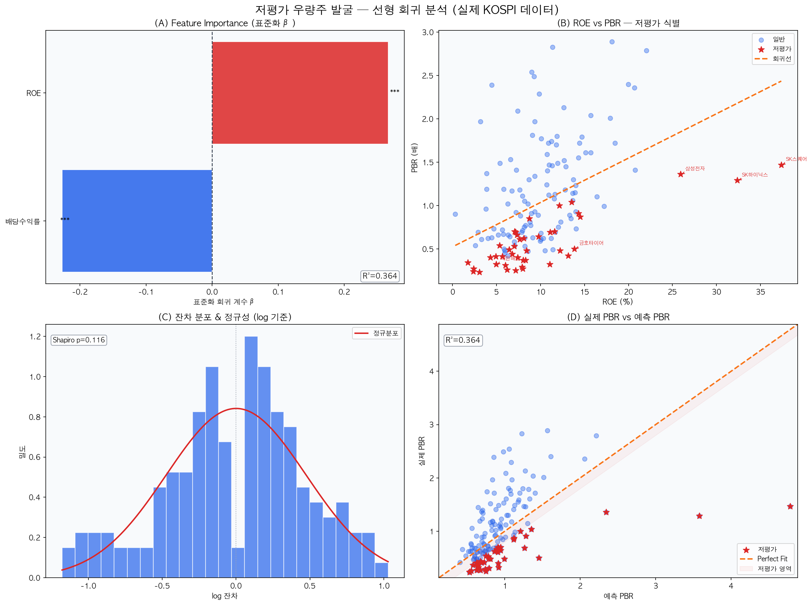
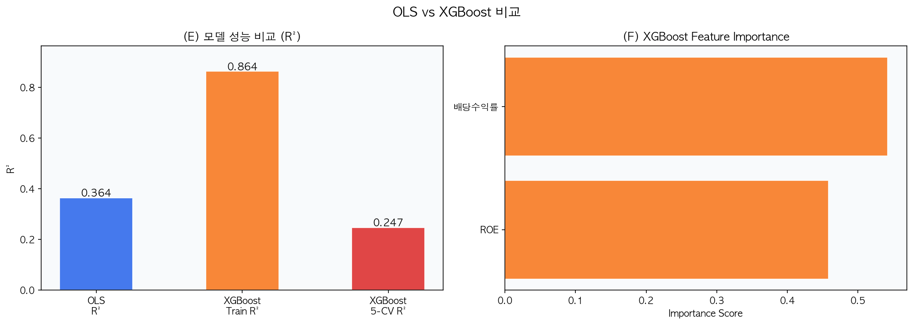

# 📊 KOSPI 저평가 우량주 발굴 모델

> 선형 회귀 + XGBoost 기반 KOSPI 저평가 종목 식별 시스템  
> FinanceDataReader × statsmodels × XGBoost × Tableau

---

## 🔍 개요

KOSPI 보통주의 재무 데이터를 수집하고, **log(PBR)를 타겟**으로 한 선형 회귀 모델을 통해
시장에서 구조적으로 저평가된 종목을 발굴합니다.

단순 PBR 순위 기반 선정이 아닌, **ROE·배당수익률 대비 PBR이 얼마나 낮은지**를 잔차로 측정해
"우량한데 저평가된" 종목을 정량적으로 식별합니다.

OLS 회귀 분석 후 **XGBoost로 비선형 관계 존재 여부를 검증**하여 모델의 신뢰성을 높였습니다.

---

## 📁 파일 구성

```
├── 01_KOSPI저평가우량주_회귀모델.py   # 전체 KOSPI 저평가 우량주 발굴 모델 (OLS + XGBoost)
├── 02_단일종목_저평가진단.py          # 단일 종목 심층 진단 모델
├── regression_result_realdata.png    # OLS 분석 결과 시각화
├── xgboost_comparison.png            # OLS vs XGBoost 비교 시각화
└── README.md
```

### 모델 1 — 전체 KOSPI 분석
- KOSPI 보통주 300개 대상 재무 데이터 수집 → 유효 샘플 **151개**
- OLS 회귀로 저평가 종목 **41개** 식별
- XGBoost로 비선형 관계 검증
- 시장 전체의 구조적 저평가 패턴 분석

### 모델 2 — 단일 종목 심층 진단
- 원하는 종목 코드 1개 입력 → 자동 진단 리포트 생성
- KOSPI 비교군 대비 백분위 순위 시각화
- 동아리 밸류에이션 분석과 병행 활용

---

## 🧠 방법론

### Target & Features

| 구분 | 변수 | 설명 |
|------|------|------|
| **Target** | `log(PBR)` | 오른쪽 치우침 보정, 정규성 개선 |
| Feature 1 | `ROE` | β = +0.266, p < 0.001 |
| Feature 2 | `배당수익률` | β = −0.227, p < 0.001 |
| Feature 3 | `자사주소각` | DART 공시 기반 더미 변수 |

### 분석 파이프라인

```
데이터 수집          정제 & 검증            모델링                   검증
FinanceDataReader → 결측치 제거 → VIF 검사 → OLS 회귀  → XGBoost 비교
DART API           극단값 필터   StandardScaler  log(PBR)   5-fold CV
```

### 주요 결과

| 지표 | 값 |
|------|-----|
| 분석 샘플 수 | 151개 종목 |
| OLS R² | **0.364** |
| XGBoost Train R² | 0.864 (과적합) |
| XGBoost 5-CV R² | 0.247 |
| 저평가 종목 식별 | **41개** |
| 정규성 검정 (Shapiro-Wilk) | p = 0.116 ✓ |

**핵심 인사이트**
- ROE가 PBR의 핵심 드라이버 (β = +0.266)
- 한국 고배당주의 구조적 저평가 현상 발견 (β = −0.227)
- XGBoost 5-CV R²가 OLS보다 낮아 **선형 관계가 지배적**임을 검증

---

## 📊 시각화 결과

### OLS 회귀 분석 결과


### OLS vs XGBoost 비교


> 분석 결과는 **Tableau 대시보드**로 인터랙티브하게 시각화

🔗 **[대시보드 바로보기](https://public.tableau.com/views/KOSPI_17780779665960/KOSPI?:language=ko-KR&publish=yes&:sid=&:redirect=auth&:display_count=n&:origin=viz_share_link)**

---

## ⚙️ 실행 방법

```bash
pip install finance-datareader opendartreader xgboost scikit-learn statsmodels matplotlib
```

```python
# 01_KOSPI저평가우량주_회귀모델.py 상단 설정값만 변경
MAX_CNT      = 300        # 수집 종목 수
DART_API_KEY = "..."      # https://opendart.fss.or.kr 무료 발급

# 02_단일종목_저평가진단.py
TARGET_CODE = '005930'    # 분석할 종목 코드 (삼성전자)
```

---

## 🔧 한계 및 개선 방향

| 한계 | 개선 방향 |
|------|---------|
| 유효 샘플 151개 (결측치·필터링 후) | 다년도 패널 데이터로 확장 |
| XGBoost 과적합 (Train R²=0.864 vs CV R²=0.247) | 하이퍼파라미터 튜닝, 샘플 확대 |
| 단면 데이터 (1년치) | 시계열 분석으로 확장 |

---

## 🛠️ 사용 기술


---

## 👩‍💻 만든 사람

서울여자대학교 데이터사이언스학과  
금융투자(밸류에이션) 동아리 활동 병행
